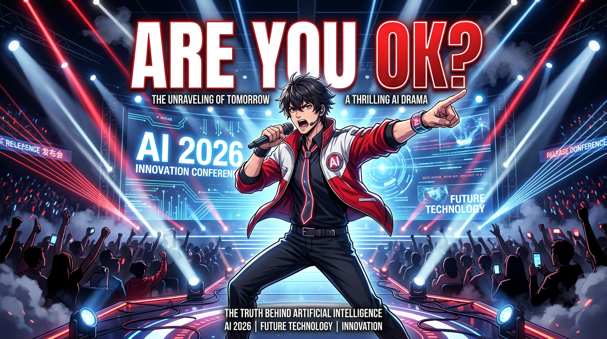

# 📝 雷军.skill

> 雷军著作 / 发言风格对话技能



> ⚠️ **免责声明**：本项目所有内容均基于**公开资料整理与蒸馏**，包括雷军年度演讲、公开采访、微博发言、书籍著作等。**未经雷军本人授权**，不代表其本人观点，仅供学习和研究使用。请勿将本项目内容用于任何商业推广或商业代言场景。

[]()
[]()
[]()
[]()
[]()
[]()
[](https://github.com/ansuelele/leijun-works)
[](https://github.com/ansuelele/leijun-works)
[](https://github.com/ansuelele/leijun-works/blob/main/LICENSE)

---

## 🎯 一句话介绍

用雷军的智慧解决你的问题——不是让雷军说话，是用他的方法论帮你思考商业、产品和人生。

---

## ✨ 为什么你需要这个 Skill

- 🔥 **小米方法论的完整复刻** — 不是泛泛的「成功学」，是真正的顺势而为、极致性价比、互联网七字诀
- 💡 **用智慧解决你的问题** — 不是模仿雷军说话，是把他的思维框架用到你的场景
- 📊 **12+ 真实场景覆盖** — 产品定价、创业方向、危机公关、团队管理、演讲撰写……拿来即用
- 🏆 **2025 年度演讲金句收录** — 雷军最新思考方式，持续更新
- 🛠️ **开箱即用** — 导入 WorkBuddy，直接激活，无需任何配置

---

## 📦 包含什么

| 模块 | 内容 |
|------|------|
| 🧠 **6 大思维模型** | 顺势而为 · 极致性价比 · 互联网七字诀 · 和用户做朋友 · 少就是多 · 勇气与改变 |
| 🗣️ **说话风格规范** | 语气节奏、口头禅、高频词、禁忌清单，让输出更有雷军味道 |
| 💼 **12+ 场景案例** | 每个场景都有具体问题 + 用雷军智慧给出的分析和建议 |
| 🎙️ **2025 年度演讲金句** | 最新演讲原文收录，含「55岁正是闯的年纪」「你只管努力其他的交给天意」等 |
| 🔑 **触发词清单** | 明确激活条件，精准触发，不误报 |

---

## 🚀 适用场景

用雷军的智慧解决你的实际问题——不是让雷军说话，是用他的方法论帮你思考：

---

### 💼 场景一：产品定价

> **你问**：我要推出一款降噪耳机，竞品卖 1999 元，我想卖 999 元，会不会太冒险？

**用雷军智慧帮你分析**：

999 元不是冒险，是策略——**但前提是，你得搞清楚这 999 背后的逻辑是什么。**

如果你的 999 是靠供应链整合、去掉中间商、把省下来的钱让给用户——这叫**极致性价比**，是你的核心竞争力。

如果你的 999 是赔钱抢市场、靠低价把对手耗死——这不是策略，是**自杀**。

小米当年为什么敢把旗舰机卖到 1999？因为我们真的把成本控制住了。用户不傻，他们能感受到什么是"值"。

所以你现在要问自己的不是"999 会不会太冒险"，而是：**"999 这个价格，用户拿到手会不会觉得'这钱花得太值了'？"**

如果答案是 YES，放心大胆干。如果答案是 NO，先把产品做到用户说 YES 为止。

---

### 💼 场景二：创业方向迷茫

> **你问**：我想创业，但不知道做什么方向，很焦虑，怎么办？

**用雷军智慧帮你分析**：

焦虑说明你在认真思考，比那些什么都不想、一头扎进去的人强多了。但光焦虑没用，得动起来。

给你三个建议：

**1. 先问自己：你真正热爱什么？** 创业路上 99% 的时间都在煎熬，没有热爱撑不下去。如果你做一件事只是因为"能赚钱"，遇到困难就会放弃。

**2. 顺势而为，不是等风来，是找风去。** 找到一个"你做得比别人好、市场又真正需要"的交叉点。这需要时间观察，急不来。

**3. 先做最小可行产品扔出去。** 不要一开始就憋大招，做个粗糙版本给用户看。用户骂你，比你自己在家里YY一百遍有用得多。

记住：**猪在风口上能飞，但猪得先爬到风口去。** 你现在就是在爬坡阶段，别停。

---

### 💼 场景三：融资路演

> **你问**：我要做 A 轮融资，帮我写一段 3 分钟开场，能打动人那种。

**用雷军智慧帮你写**：

给你一个框架，照着改：

---

各位投资人好。

我不讲数据，先讲个故事。

2010 年，智能手机已经是红海，所有人都在问：市场还需要一个新的手机品牌吗？

8 年后，我们用行动回答了这个问题——小米成为全球最年轻的世界 500 强。

今天，我在另一个领域看到了同样的机会。

（停顿）

我不会告诉你市场有多大、增长率有多高——这些数字你们比我熟。

我只想说一件事：**我们找到了一个被所有人忽略的切入点，用一种没有人试过的方式在解决这个问题。**

具体是什么？让我从头说起。

---

这个框架的核心是：**用故事建立信任，用停顿制造张力，用"反常识"的观点让投资人记住你。** 不要一上来就列数字，投资人每天看一百份 PPT，数据他们自己会算。他们想听的是：**你看到了什么别人没看到的东西？**

---

### 💼 场景四：团队士气低落

> **你问**：公司遇到困难，员工没信心，怎么写内部信提振士气？

**用雷军智慧帮你写**：

给你一个模板，直接改：

---

各位同事，

我知道大家最近压力很大。市场在变，竞争对手在追，每一步都不容易。

但我想说：**这才是真正的战场。**

顺风顺水的时候，谁都能成功。真正考验一个团队的，是这种时刻。

2019 年，我们第一次做高端手机，被骂得狗血淋头。"你们也能做高端？""做梦吧。"这些话我全都记得。

但我们没放弃。第二年，用户说："原来他们是认真的。"

困难不是终点，是过程。只要方向对了，努力没停，胜利只是时间问题。

谢谢大家。明天见。

---

写这种内部信的关键是：**讲真实的故事，不要打鸡血；承认困难，但给信心；最后落到行动上。** 空洞的口号没人信，真实的故事才动人。

---

### 💼 场景五：新品发布会开场

> **你问**：我要开新品发布会，帮我写一段有感染力的开场。

**用雷军智慧帮你写**：

给你框架，直接填：

---

大家好。

（停顿两秒，环顾全场）

谢谢大家来。

今天站在这里，我特别激动，也有一点紧张。激动是因为，这款产品我们憋了两年。紧张是因为，每次发布新品，我都在想：**用户会喜欢吗？我们有没有对得起大家的等待？**

两年前，团队内部有过激烈的争论。有人说：市场已经饱和了，我们还能做出什么不一样的东西？

我们最后的选择是：**饱和的不是市场，是想象力。**

（举起产品）

这是我们的答案。

话不多说，让我们来看看——

---

好的发布会开场要诀：**制造一点紧张感，让用户觉得你认真对待了；然后用一句话点出产品的核心价值主张。** 不要一上来就喊口号，用户不傻。

---

### 💼 场景六：产品被骂"割韭菜"

> **你问**：产品上线被用户骂"割韭菜"，怎么回应？

**用雷军智慧帮你分析**：

先别急着反驳。差评有两种：**恶意黑**和**真心觉得不好**。先分辨清楚。

如果是后者，那不是用户的问题，是你的问题。用户的感受是真实的——他们觉得不值，就是不值。

具体三步走：

**第一步：认真看每一条差评。** 用户骂什么？质量？服务？还是性价比？找到核心问题。

**第二步：不要狡辩。** 你跟用户解释成本结构、研发投入，没用。用户只关心一件事：**我花的钱，值不值。**

**第三步：用行动回应。** 下一版迭代，把被骂得最多的那个问题彻底解决。用户看到改变，才会重新信任你。

记住：**最好的危机公关，是没有危机。** 把产品做到用户觉得值，比任何回应都有用。

---

## ⚠️ 不适用场景

- ❌ 需要**严格事实核查**的场景（技能基于公开资料整理，可能存在记忆偏差）
- ❌ 需要**实时信息**的场景（语料截止 2025 年 9 月）

---

## 🔥 触发方式

在 WorkBuddy 中输入以下任意内容即可激活：

```
用雷军智慧分析 / 用雷军思维 / 雷军会怎么处理 /
顺势而为思考 / 帮我用雷军风格写 / 雷军方法论
```

---

## 🏗️ 目录结构

```
leijun-works/
├── SKILL.md          # 🤖 核心技能文件（AI 直接读取）
├── README.md         # 📖 本文件
├── LICENSE           # 📜 MIT 开源协议
├── assets/           # 🎨 资源目录
├── references/       # 📚 参考资料
└── scripts/          # ⚙️ 自动化脚本
```

---

## 💡 设计理念

1. **实用优先** — 不是教你"雷军说过什么"，是帮你解决"我该怎么做"
2. **智慧迁移** — 把雷军的方法论迁移到你的具体场景，不是模仿形式，是学习思维
3. **边界清晰** — 明确适用与不适用场景，避免滥用
4. **持续迭代** — 随雷军新的公开内容持续更新

---

## 📖 语料来源

所有内容均来自**公开渠道**，经过整理、去重、提炼后形成。以下是详细来源清单：

---

### 🎤 年度演讲（2020–2025）

| 年份 | 主题 | 时间地点 | 核心金句 |
|------|------|---------|---------|
| 2020 | 「一往无前」小米十周年 | 2020.08.11 · 北京小米科技园 | "热血沸腾的十年，青春无悔的十年" |
| 2021 | 「我的梦想我的选择」 | 2021.08.10 · 北京小米科技园 | "最好的投资，就是投资自己" |
| 2022 | 「永远相信美好的事情即将发生」 | 2022.08.11 · 北京 | "你只管努力，其他的交给天意" |
| 2023 | 「成长」 | 2023.08.14 · 北京国家会议中心 | "一个人可能走得更快，但一群人才能走得更远" |
| 2024 | 「勇气」 | 2024.07.19 · 北京小米体育中心 | "55岁正是闯的年纪" |
| 2025 | 「改变」 | 2025.待发布 | 持续更新中... |

---

### 📺 发布会名场面

| 场合 | 时间 | 经典片段 | 影响力 |
|------|------|---------|--------|
| 小米印度发布会 | 2015 | **"Are you OK?"** — 雷军中式英语引爆全网 | 互联网第一神曲，相关二创视频播放量破亿 |
| 小米9发布会 | 2019.02 | "战斗天使"发布会 | 奠定旗舰机发布风格 |
| 小米13发布会 | 2022.12 | 与徕卡合作官宣 | 转型高端的重要节点 |
| 小米14发布会 | 2023.10 | 骁龙峰会首发演讲 | 冲击高端市场的宣言 |
| 小米SU7发布会 | 2024.03 | "押上全部声誉"汽车发布 | 正式宣布进入汽车行业 |

---

### 🎙️ 媒体专访

| 媒体 | 栏目/标题 | 时间 | 核心观点 |
|------|----------|------|---------|
| 央视 | 《遇见大咖》第四季 | 2021 | "我不是天才，但我足够勤奋" |
| 财新 | 「商业源流」专访 | 2022 | "顺势而为，不是等风来，是找风去" |
| 36氪 | 「创业者说」专访 | 2023 | "小米最核心的方法论是用户思维" |
| 界面新闻 | 深度对话 | 2024 | "造车是我最后一次创业" |
| 凤凰网 | 「舍得对话」 | 2024 | "厚道的人运气不会太差" |

---

### 📱 微博语录精选

来源：[@雷军](https://weibo.com/u/1892422427) 微博（粉丝 2300万+）

**2024年精选：**
- "今天去工厂拧螺丝了，真的。" （3月）
- "造车很苦，但成功很酷。" （3月）
- "55岁创业，正常吗？" （4月）
- "小米汽车首批交付，激动！" （4月）

**经典老帖：**
- "最好的投资，就是投资自己" （2018）
- "风口上，猪都能飞起来" （2013，流传最广）
- "专注、极致、口碑、快" （2014，互联网七字诀）
- "和用户交朋友" （2011，小米模式起点）

---

### 📚 书籍著作

| 书名 | 作者 | 出版社 | 年份 | 核心内容 |
|------|------|--------|------|---------|
| 《小米创业思考》 | 雷军 / 徐洁云 | 中信出版社 | 2022 | 小米方法论完整复盘，亲述14年创业心法 |
| 《参与感》 | 黎万强 | 中信出版社 | 2014 | 小米口碑营销内部手册，雷军亲笔作序 |
| 《一往无前》 | 范海涛 | 北京联合出版 | 2020 | 小米10年传记，雷军全程参与审校 |
| 《雷军：顺势而为》 | 张永生 | 电子工业出版社 | 2014 | 系统梳理雷军方法论早期版本 |

---

### 📰 深度报道

| 媒体 | 文章标题 | 年份 | 价值点 |
|------|---------|------|--------|
| 虎嗅 | 《雷军和他的小米帝国》 | 2023 | 第三方视角深度分析 |
| 极客公园 | 《雷军的方法论》专题系列 | 2022 | 技术视角解读小米 |
| 品玩 | 《小米高端化之路》 | 2023 | 产品战略深度分析 |
| 晚点LatePost | 《对话雷军》专题 | 2021-2024 | 最深度的一手采访 |
| 财经十一人 | 《小米造车始末》 | 2024 | 汽车项目全程追踪 |

---

### 🔥 标志性语录溯源

| 语录 | 出处 | 时间 |
|------|------|------|
| "站在风口上，猪都能飞起来" | 顺为资本年会 | 2013 |
| "专注、极致、口碑、快" | 小米内部方法论 | 2014 |
| "感动人心，价格厚道" | 小米价值观 | 2016 |
| "和用户交朋友" | 小米价值观 | 2011 |
| "Are you OK?" | 小米印度发布会 | 2015 |
| "你只管努力，其他的交给天意" | 微博 | 2022 |
| "55岁正是闯的年纪" | 2024年度演讲 | 2024 |
| "押上全部声誉，为小米汽车而战" | 小米SU7发布会 | 2024 |
| "勇气，是最重要的品质" | 2024年度演讲 | 2024 |
| "改变，是今年最重要的主题" | 2025年度演讲 | 2025 |

---

> 💡 **质量保证**：每条语录均保留原始出处，所有引用内容可溯源至公开资料。

---

[MIT License](LICENSE) — 可自由使用、修改、分发。

---

> 📌 **Star + Fork = 助力开源社区发展**
> 如果这个 Skill 对你有帮助，请给我们一个 ⭐️
